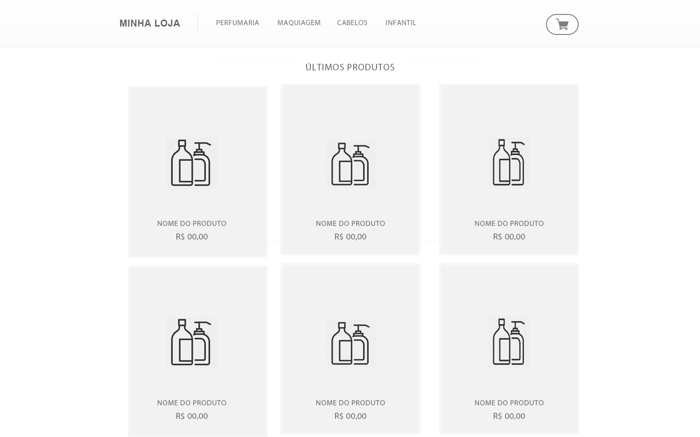

# Quero trabalhar na Boticário: Front-End
Desenvolver uma aplicação HTML5 + CSS3 + JS

## Instruções
- Faça um fork desse projeto para a sua conta pessoal do GitHub, ou BitBucket.
- Siga as especificações abaixo.
- Crie um README com as instruções para compilar, testar e rodar o projeto.
- O link do repositório deverá ser enviado para o e-mail osni.junior@grupoboticario.com.br com o título **Teste Front-End**

## Especificações técnicas
- Utilizar HTML5, CSS3 e JS (Vanilla, jQuery, Vue ou React... Fica a seu critério)
- Mobile first e responsivo

## A missão
Desenvolver uma página, baseando-se no wireframe abaixo (PSD e PNG na pasta assets):

Hover mini cart:

- Os produtos precisam ser consumidos de um .json (está na pasta assets) via ajax.
- Ao clicar no produto, o mesmo deve ser adicionado ao carrinho.
- Último e não menos importante, deixe sua imaginação fluir.

## O que será avaliado?
- Semântica Web
- Organização do código
- Lógica do código
- Uso do Git
- Documentação
- Automação de tarefas (Gulp? Grunt? Webpack? :D)
